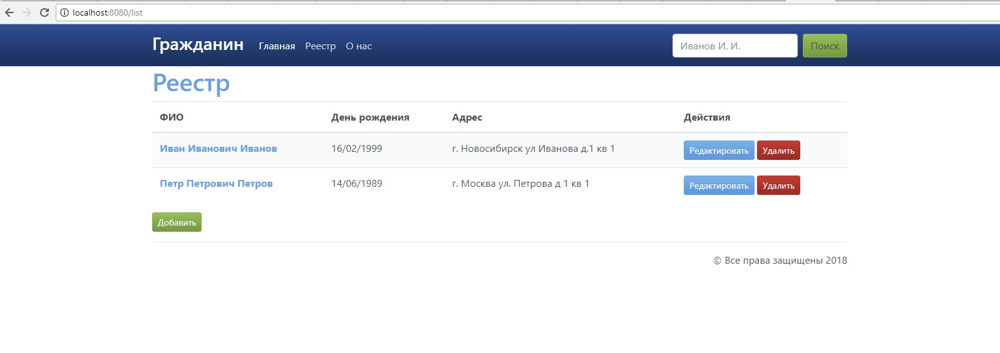
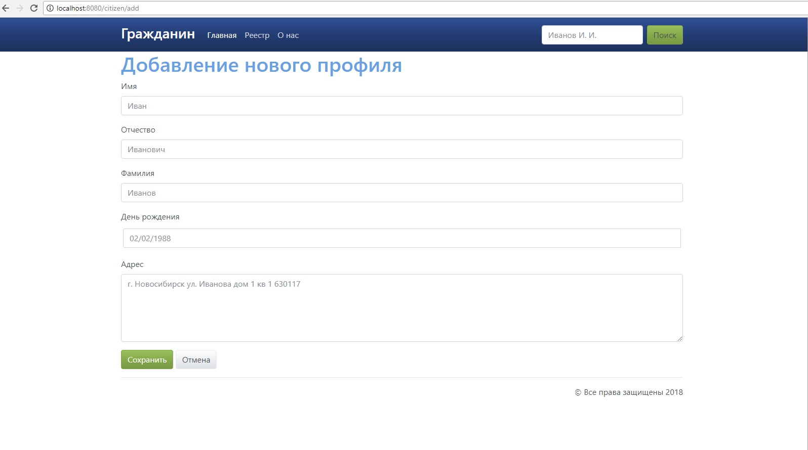
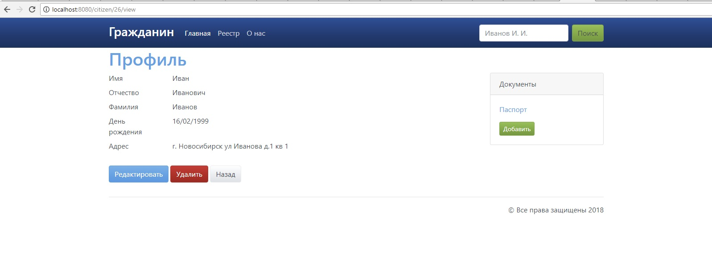
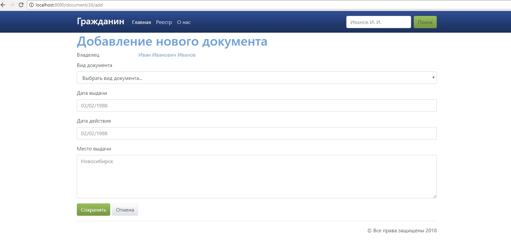

"# CitizenApplication"
 
CitizenApplication is CRUD application.
Functions: 
1. create, read, delete, update citizen profile
2. create, read, delete, update  citizen document info
3. search for citizen by substring in full name

Environment
 
1. Java version 8
2. Maven 3.5.3
3. MySQL 5.0.51
4. Hibernate 4.3.6.Final
5. Tomcat 7.0.86
6. Spring 4.1.9 Release
7. MySQL JDBC Connector 5.0.4

Installation

1. install MySQL
2. execute CitizenApplication\db-schema.sql
3. unwrap Tomcat7
4. mvn install
5. move ../target/CitizenApplication.war to Tomcat7/webapps
6. run Tomcat7/bin/startup.bat for Windows
7. go to http://localhost:8080/CitizenApplication

Images

1. List

2. Citizen add

3. Citizen view

4. Document add
